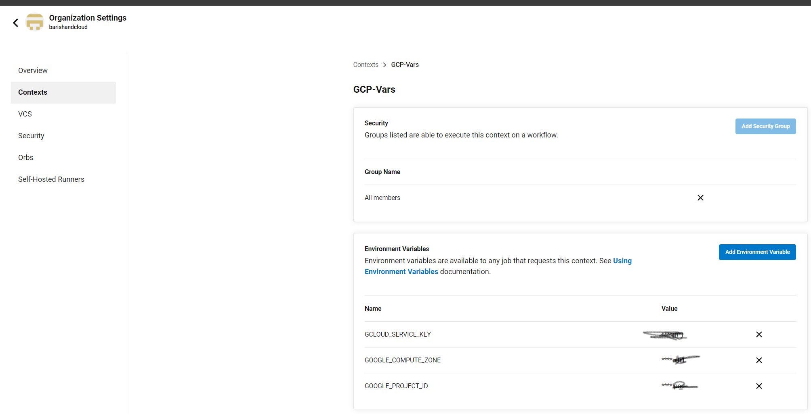
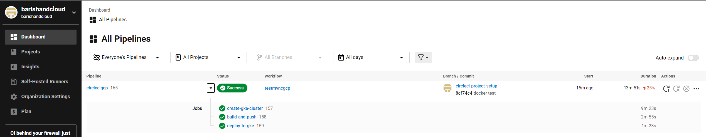
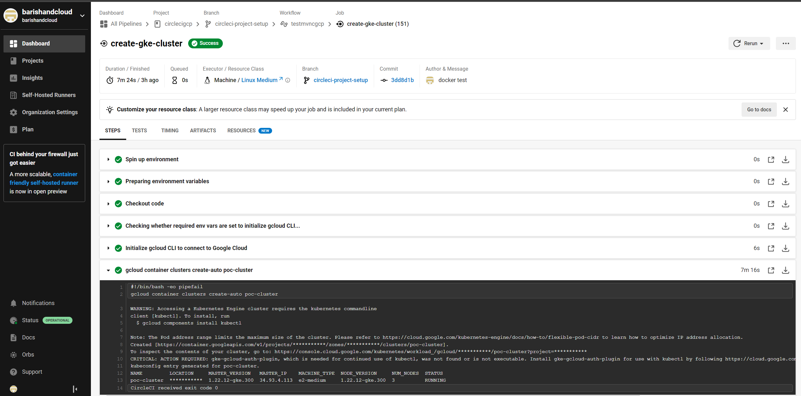

# CircleCI deployment for Spring PetClinic Sample Application on a GKE cluster.

## Prerequisite for running this on CircleCI
1 - CircleCI account - I've used GitHub to create this account.
2 - GCP Account
3 - GitHub Account

Navigate to GCP Console once created.
 Enable the following APIs:
    resource manager
    iam api
    kubernetes api
    resource manager api
    container registry api
 create a service account & generate a key using: https://cloud.google.com/iam/docs/creating-managing-service-account-keys. Download the associated json for the same. 
Now login to CircleCI account and navigate to Org Settings to create a context (the one used in this case is called GCP-Vars).
Create three env vars in it:
GCLOUD_SERVICE_KEY - copy the json created from service account and paste it in this as value
GOOGLE_COMPUTE_ZONE - I've used ap-south1
GOOGLE_PROJECT_ID - Mention the ProjectID present in the google account.
Clone this repo:
```
git clone https://github.com/barishandcloud/circlecigcp.git
```
In Github create a repo that is meant to act as a trigger for CircleCI.
In CircleCI Dashboard you can link the project to Github.
Push the Cloned repo to newly created github repo to trigger the pipeline.

The Pipeline has three jobs:
1 - Creates the GKE Cluster
2 - Maven Builds and pushes uses the Jar to create a Docker Image, which is pushed to GCR
3 - Deploy the image to GKE and expose it as service via a LoadBalancer

You can then access petclinic at the public IP provided by the Loadbalancer

Context

Dashboard

Job


